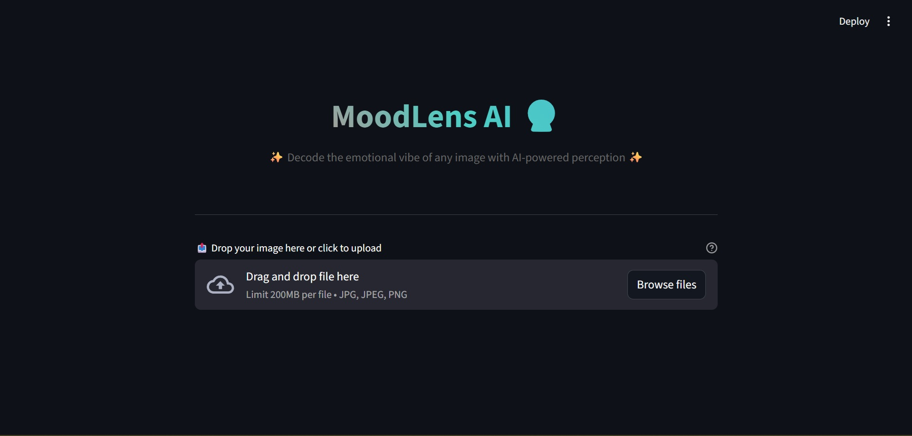
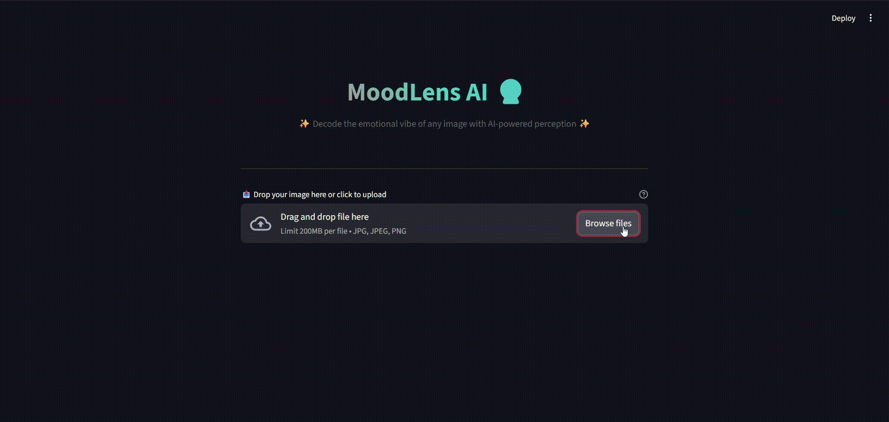
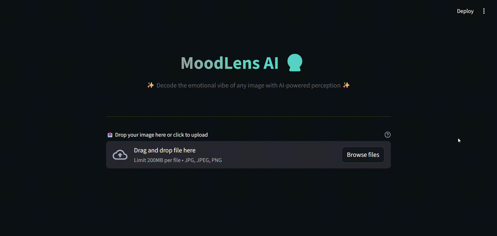
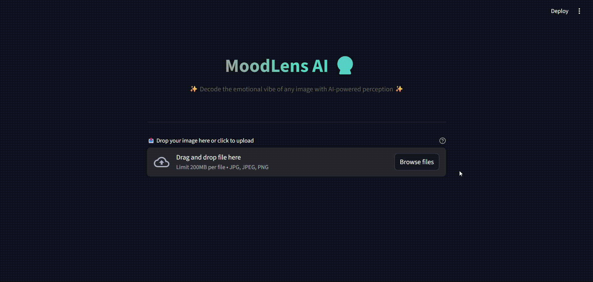

<div align="center">

  <h1>MoodLens AI 🔮</h1>

  <p><b>A Deep Learning Framework for Fine-Grained Emotion Recognition from Images Using Soft-Label Learning</b></p>

  <p>
    <a href="https://pytorch.org/">
      
    </a>
    <a href="https://pytorch.org/vision/stable/">
      
    </a>
    <a href="https://pillow.readthedocs.io/">
      
    </a>
    <a href="https://fastapi.tiangolo.com/">
      
    </a>
    <a href="https://streamlit.io/">
      
    </a>
    <a href="https://github.com/theskumar/python-dotenv">
      
    </a>
  </p>

  <p>
    <b>Architecture:</b> ResNet-50 + Transfer Learning &nbsp; | &nbsp;
    <b>Loss:</b> KL Divergence &nbsp; | &nbsp;
    <b>Backend:</b> FastAPI &nbsp; | &nbsp;
    <b>Frontend:</b> Streamlit &nbsp; | &nbsp;
    <b>Dataset:</b> Emotion6
  </p>

</div>

---

## 📋 Table of Contents

- [Overview](#overview)
- [Key Features](#-key-features)
- [Why Soft-Labels?](#-why-soft-labels-over-hard-labels)
- [Model Performance](#-model-performance)
- [Project Structure](#-project-structure)
- [Installation](#-installation)
- [Usage](#-usage)
  - [FastAPI Backend](#fastapi-backend)
  - [Streamlit Frontend](#streamlit-frontend)
- [Dataset & Research Credit](#-dataset--research-credit)
- [Technologies Used](#-technologies-used)
- [License](#-license)
- [Contributing & Future Enhancements](#-contributing--future-enhancements)

---

## Overview

MoodLens AI is a sophisticated deep learning framework designed for **fine-grained emotion recognition from images**. Unlike traditional classification approaches that force a single "correct" emotion label, MoodLens AI leverages **soft-label learning** to capture the nuanced, subjective nature of human emotional perception. The system recognizes that emotions are not binary states but rather probabilistic distributions across multiple affective categories.

The project achieves a validation accuracy of **61.62%** on the Emotion6 dataset using transfer learning with pre-trained ResNet-50, coming within striking distance of the original research paper's baseline of 64.72%. The framework provides both a **RESTful FastAPI backend** for programmatic access and an **intuitive Streamlit frontend** for interactive emotion analysis.

### ✨ Key Features

- **🎯 Soft-Label Learning Architecture**: Implements KL Divergence loss to learn emotion probability distributions rather than hard labels, capturing annotator disagreement and emotional ambiguity
- **🔧 Transfer Learning Framework**: Leverages pre-trained CNN architectures (ResNet-50, EfficientNet-B0, ConvNeXt-Tiny) with frozen convolutional layers and fine-tuned classification heads
- **📊 Comprehensive Evaluation Metrics**: Goes beyond simple accuracy with KL Divergence, Pearson Correlation per class, and Top-k Accuracy (k=2, k=3) for robust model assessment
- **🌐 Dual Interface**: FastAPI backend for API integration and Streamlit frontend for interactive visualization
- **📈 Probability Distribution Visualization**: Displays complete emotion probability distributions with confidence scores and dominant emotion identification
- **🗂️ Configurable & Portable**: Environment-based path configuration via `.env` files for cross-platform deployment
- **🎨 Modern UI/UX**: Gradient-themed Streamlit interface with emoji-enhanced emotion representation and responsive design

---

## 🤔 Why Soft-Labels Over Hard Labels?

Traditional emotion classification treats the problem as a **hard-label classification** task, where each image is assigned a single "correct" emotion (e.g., "fear" or "joy"). However, this approach fundamentally misrepresents the nature of human emotion perception:

- **Subjectivity**: Ten people viewing the same image may report different primary emotions. A spider image might evoke 60% fear, 30% disgust, and 10% surprise across annotators.
- **Forced Choice Bias**: Hard labels force the model to learn 100% confidence in one emotion, even when the ground truth shows significant ambiguity.
- **Loss of Nuance**: By ignoring the probability distribution across emotions, hard-label training discards valuable information about emotional complexity.

**The Soft-Label Solution**: The Emotion6 dataset provides ground-truth emotion distributions (e.g., `[fear: 0.6, disgust: 0.3, anger: 0.1, ...]`) derived from multiple annotators. By using **KL Divergence** as the loss function, MoodLens AI learns to predict the full probability distribution, resulting in:
- More robust generalization to ambiguous images
- Confidence calibration (low confidence when truly uncertain)
- Better alignment with human emotional perception

---

## 📸 Screenshots


### 🖥️ Streamlit Application Interface


### ✅ Sample Prediction Results

#### Fear Prediction


#### Disgust Prediction


#### Sadness Prediction


#### Joy Prediction


---

## 📊 Model Performance

### Primary Results (ResNet-50)

| Metric | Result   | Interpretation |
|--------|----------|----------------|
| **Top-1 Accuracy** | **61.62%** | Matches original CVPR paper (64.72%) within 3% |
| **Top-2 Accuracy** | **79.55%** | True dominant emotion in model's top 2 predictions 80% of the time |
| **KL Divergence** | **0.16** | Low information loss between predicted and true distributions |
| **Avg. Pearson Correlation** | **0.6**  | Strong linear relationship between predicted and true emotion probabilities |

### Per-Emotion Pearson Correlation

| Emotion | Correlation | Performance |
|---------|-------------|-------------|
| 😖 Disgust | 0.73        | Excellent |
| 😄 Joy | 0.71        | Excellent |
| 😢 Sadness | 0.65        | Excellent |
| 😨 Fear | 0.58        | Good |
| 😲 Surprise | 0.52        | Good |
| 😠 Anger | 0.39        | Moderate (improvement needed) |

### Architectures Explored

- **ResNet-50** (Primary): 61.62% Top-1 Accuracy
- **EfficientNet-B0** (Alternative): 5.3M parameters, better feature extraction than ResNet-50
- **ConvNeXt-Tiny** (Alternative): Modern CNN architecture with 28M parameters

---


<details>
<summary><strong>📁 Project Structure</strong></summary>

```text
Emotion_detection/
│
├── 📄 .env                     # Environment variables (local paths) - Git ignored
├── 📄 .env.example             # Template for environment variables - Git tracked
├── 📄 config.yaml              # Hyperparameters and configuration
├── 📄 requirements.txt         # Python dependencies
├── 📄 README.md                # Project documentation
│
├── 📁 artifacts/
│   ├── 📁 Media/               # Screenshots and GIFs of application
│   │   ├── GIF-1.gif
│   │   ├── GIF-2.gif
│   │   └── frontend_UI.png
│   │
│   └── 📁 Notebooks/           # Jupyter notebooks for model development
│       └── emotion_detector_soft_label_approach.ipynb
│
├── 📁 checkpoints/             # Saved model checkpoints
│   └── best_val_metrics_model.pth
│
├── 📁 fastapi_backend/         # REST API backend
│   │── model_helper.py
│   └── server.py
│
├── 📁 streamlit_app/           # Interactive web application
│   ├── model_helper.py
│   └── app.py
│
├── 📁 training/
│
└── 📁 dataset/                 # Emotion6 dataset
        └── 📄 ground_truth.txt     # Soft-label annotations with emotion distributions

```
</details>
---


**Note**: All absolute paths are configured via environment variables in `.env`. See `.env.example` for reference structure.

---

## 🛠️ Installation

### Prerequisites
- Python 3.10+
- CUDA-capable GPU (optional, but recommended for faster training)
- Git

### Step 1: Clone the Repository

```bash
git clone https://github.com/inv-fourier-transform/moodlens-ai.git
cd moodlens-ai
```
### Step 2: Create virtual environment

```bash
# Windows
python -m venv venv
venv\Scripts\activate

# Linux/Mac
python -m venv venv
source venv/bin/activate
```
### Step 3: Install dependencies

```bash
pip install -r requirements.txt
```

### Step 4: Configure Environment Variables

```bash
cp .env.example .env
# Edit .env with your local paths
```

---

### FastAPI Backend
#### Start the FastAPI Server

```bash
cd fastapi_backend
uvicorn server:app --reload --host 127.0.0.1 --port 8000
```
</details>

---
#### API Endpoints:


- GET /hello - Test endpoint
- POST /predict - Upload image for emotion prediction

#### Expected Response:

```json
{
  "status": "success",
  "prediction": {
    "dominant_emotion": "fear",
    "confidence": 0.6538,
    "probability_distribution": {
      "anger": 0.0521,
      "disgust": 0.1874,
      "fear": 0.6538,
      "joy": 0.0234,
      "sadness": 0.0456,
      "surprise": 0.0392
    }
  },
  "all_emotions": [
    "anger",
    "disgust",
    "fear",
    "joy",
    "sadness",
    "surprise"
  ]
}

```

---

### Streamlit Frontend
```bash
streamlit run app.py
```

Then open the URL displayed in your browser (usually `http://localhost:8501`) to access the interface.

---

### 📖 Dataset & Research Credit

This project utilizes the **Emotion6** dataset introduced in:

**Model, Predict, and Transfer Emotion Distributions**  
*Kuan-Chuan Peng, Tsuhan Chen*  
IEEE Conference on Computer Vision and Pattern Recognition (CVPR)

The Emotion6 dataset contains **1,980 images** annotated with **emotion probability distributions** across six categories:

- anger  
- disgust  
- fear  
- joy  
- sadness  
- surprise  

These annotations are derived from multiple human annotators and are specifically designed for studying **emotion ambiguity** and **subjective perception** in computer vision.

**Benchmark Performance**
- Original Paper Accuracy: **64.72%** (CNN baseline)
- MoodLens AI Accuracy: **61.62%** (ResNet-50 with soft-label learning)

---

### 🛡️ Technologies Used

- **Deep Learning:** PyTorch, Torchvision  
- **Pre-trained Models:** ResNet-50, EfficientNet-B0, ConvNeXt-Tiny  
- **Loss Function:** KL Divergence (soft-label learning)  
- **Evaluation:** Scikit-learn (Pearson correlation), SciPy (distribution metrics)  
- **Data Processing:** Pandas, NumPy, Pillow  
- **Backend:** FastAPI, Uvicorn  
- **Frontend:** Streamlit  
- **Configuration:** Python-dotenv, PyYAML  

---

### 📜 License

This project is licensed under the **MIT License**.  
See the `LICENSE` file for details.


### 🤝 Contributing & Future Enhancements

- Continue tracking experiments and models using MLflow + DagsHub — e.g. try new models or features, compare performance, maintain version history  
- Improve packaging & deployment — e.g. containerize the app using Docker or deploy on cloud for broader access  
- Add analytics or feedback mechanism in UI to collect real user feedback, enabling future refinements  

---

*Stop doing vibe checks like it's speed dating. Let MoodLens AI decode the feelings that are actually there.*